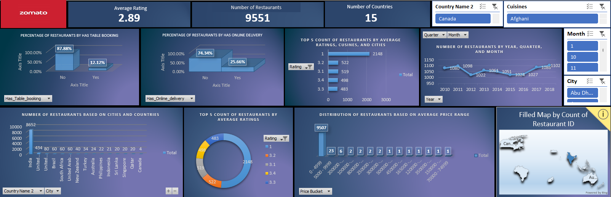
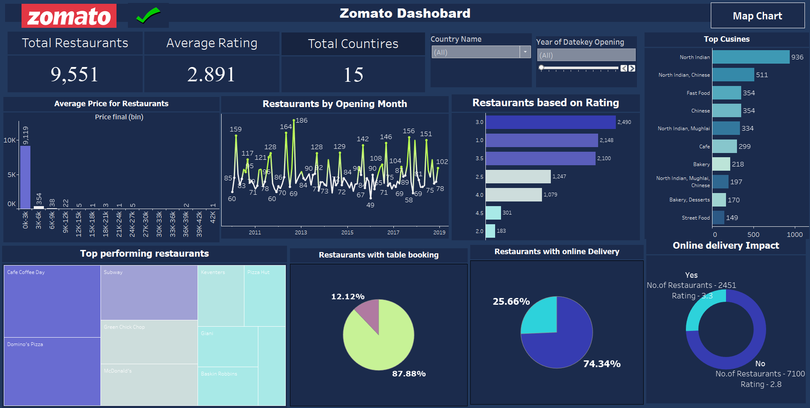
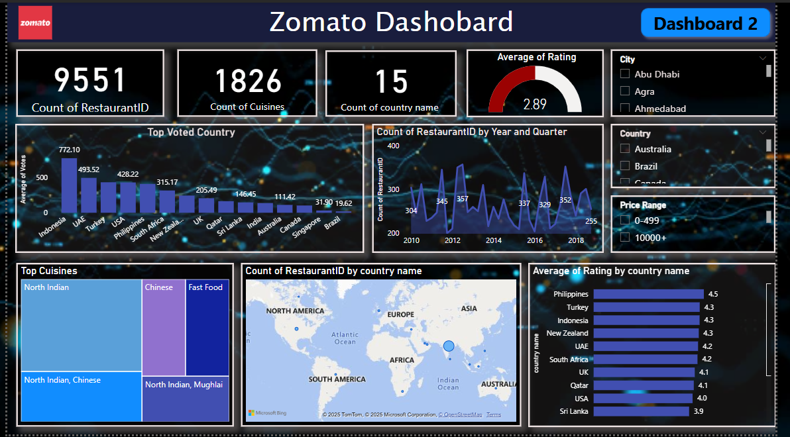
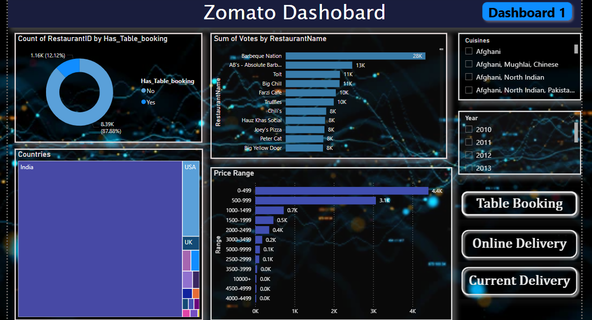

****📑 Introduction****
 This project demonstrates my complete workflow for handling a business dataset from raw data to meaningful insights. I started by thoroughly cleaning and preparing the data in Excel, ensuring it was accurate and analysis-ready. Next, I used SQL to extract key performance indicators (KPIs) and important metrics that form the backbone of the analysis.
To bring the data to life, I designed detailed and interactive dashboards using Power BI and Tableau, showcasing how the same dataset can be visualized and interpreted through different tools and perspectives. Each dashboard highlights trends, patterns, and actionable insights that support data-driven decision making.
This repository reflects my ability to combine data preparation, query writing, and visualization skills to deliver clear, insightful, and professional reports — all in one place.     

**EXCEL DASHBOARD**

**📊 Project Title**     
Zomato Global Restaurants Analysis Dashboard     

**📌 Short Description**     
This interactive Tableau dashboard explores key insights about restaurants listed on Zomato across multiple countries. It provides an overview of table booking availability, online delivery trends, restaurant counts by country, cuisine popularity, price range distribution, and rating patterns.     

**⚙️ Tech Stats**
**Tool Used:** Tableau
**Visuals:** Bar charts, donut chart, line chart, filled map
**Filters:** Country, Cuisine, City, Year, Quarter, Month
**Data Source:** Zomato dataset covering 9,551 restaurants in 15 countries

**Features and Highlights**     
✅ Summary KPIs for average rating, total restaurants, and number of countries.     
✅ Clear breakdown of restaurants that offer table booking and online delivery.     
✅ Top 5 insights for restaurants by average ratings, cuisines, and cities.     
✅ Year-over-year trend line showing restaurant count by year, quarter, and month.     
✅ Visual distribution of restaurants by price range.     
✅ Filled map to view global restaurant distribution interactively.     
✅ Dynamic filters for deep drill-down by country, cuisine, month, and city.     

**METRICS ANALYSED**
**Average Rating:** Overall restaurant rating is 2.89, indicating scope for service and food quality improvements.
**Table Booking:** Only 12.12% of restaurants offer table booking — majority do not.
**Online Delivery:** Around 25.66% offer online delivery — showing a moderate adoption.
**Top Countries:** India dominates with 8,652 restaurants, while other countries have significantly fewer listings.
**Top Average Ratings:** The largest group of restaurants is rated 1, followed by ratings between 3.1 to 3.3, which suggests rating inflation is minimal.
**Price Range:** Over 95% of restaurants fall in the lowest price bucket (0-499), confirming affordability as a key trend.
**Time Trends:** Restaurant numbers remained stable with slight fluctuations between 2010–2018, showing steady platform usage and listing growth.
**Global Distribution:** Map visualization shows high concentration in India with some presence in UAE, Australia, and the UK.

**✅ Conclusion**
This Tableau dashboard delivers crucial insights into Zomato’s restaurant data, highlighting a strong presence in India, low average ratings, limited table booking and online delivery options, and an affordable pricing landscape. It equips stakeholders with actionable data to strategize market expansion, promote premium services, and enhance customer experience on the platform.

**TABLEAU DASHBOARD**     

**📊 Project Title**     
Zomato Restaurants Business Dashboard     

**📌 Short Description**
This Tableau dashboard provides a comprehensive overview of Zomato’s restaurant listings across 15 countries, highlighting total counts, rating distributions, pricing trends, top cuisines, online delivery impact, and top performing restaurants. It enables stakeholders to understand customer preferences, operational trends, and growth patterns.

**⚙️ Tech Stats**     
**Tool Used:** Tableau     
**Visuals:** KPIs, bar charts, line chart, treemap, donut charts     
**Interactive Filters:** Country name, Year of Opening     
**Data:** 9,551 restaurants with average ratings and service options     

**Features and Highlights**     
✅ KPI Tiles for Total Restaurants, Average Rating, and Total Countries Covered.     
✅ Price Distribution: Majority of restaurants fall under the lowest price bucket (0k-3k).     
✅ Restaurants by Opening Month: Seasonality and growth trends over time.     
✅ Ratings Overview: Restaurants categorized by their average customer rating.     
✅ Top Cuisines: Popular cuisines like North Indian, Chinese, and Fast Food dominate.     
✅ Top Performing Restaurants: Treemap highlighting well-known chains such as Cafe Coffee Day, Domino’s Pizza, and Subway.     
✅ Table Booking & Online Delivery: Clear split showing how many restaurants offer these services.     
✅ Online Delivery Impact: Donut chart compares average ratings and counts for restaurants offering delivery vs. not offering.     

**METRICS ANALYSED**     
**Total Restaurants:** 9,551 listings across 15 countries.     
**Average Rating:** 2.891, slightly below an ideal customer satisfaction mark.     
**Pricing:** 9,119 restaurants priced under 3k — clear indication of a budget-friendly market.     
**Opening Trends:** Consistent growth with visible seasonality in new restaurant openings.     
**Ratings:** Highest cluster at 2.5 to 3.0 ratings; very few restaurants exceed 4.0.     
**Top Cuisines:** North Indian cuisine is the most popular with 936 listings, often paired with Chinese and Mughlai.     
**Table Booking:** Only 12.12% support table booking; a large majority do not.     
**Online Delivery:** 25.66% offer delivery; these have a higher average rating (3.3) compared to those without delivery (2.8).     
**Top Performers:** Café Coffee Day, Domino’s Pizza, Subway, and Pizza Hut stand out in performance and reach.     

**✅ Conclusion**      
This Zomato dashboard effectively visualizes how restaurants operate on the platform — highlighting affordability, popular cuisines, low table booking adoption, and the positive effect of online delivery on ratings. These insights can help management focus on enhancing service quality, expanding premium offerings, and targeting cuisines with growing demand.     

**POWERBI DASHBOARD**     

**Project Title: **
📊 Zomato Restaurant Analysis — Power BI

**📌 Short Description:**     
This Power BI report visualises Zomato’s global restaurant data with dynamic visuals and advanced tooltips for deeper, interactive insights.     

**⚙️ Tech Stats:**     
**Data Cleaning:** Excel     
**Data Extraction:** SQL (KPIs, aggregated tables)     
**Visualisation:** Power BI     

**Features and Highlights:**      
Advanced tooltip on the country-wise tree map for drilldown insights.     
Slicers for filtering by year, country, city, and price range.     
KPI cards showing total restaurants, cuisines, and countries.     
Trend lines for restaurants opened by year and quarter.     
Top cuisines and most voted countries visualised.     
Interactive map for geographical distribution.     

     
**📊 METRICS ANALYSED:**     
Total number of restaurants, cuisines, and countries.     
Average restaurant rating.     
Top cuisines and their spread.     
Country-wise and city-wise distribution.     
Voting patterns for top restaurants.     
Price range distribution.      
Table booking and online delivery availability.     
     
**✅ Conclusion:**     
Power BI helped create interactive and visually appealing dashboards that enable easy exploration of Zomato’s restaurant data across multiple dimensions and filters. The advanced tooltip feature adds depth by providing additional insights without cluttering the main view.     

*Dashboard 1: Restaurant table booking, votes, countries, and price range insights.*

*Dashboard 2: KPIs, top cuisines, country-wise trends, and advanced map tooltip.*

